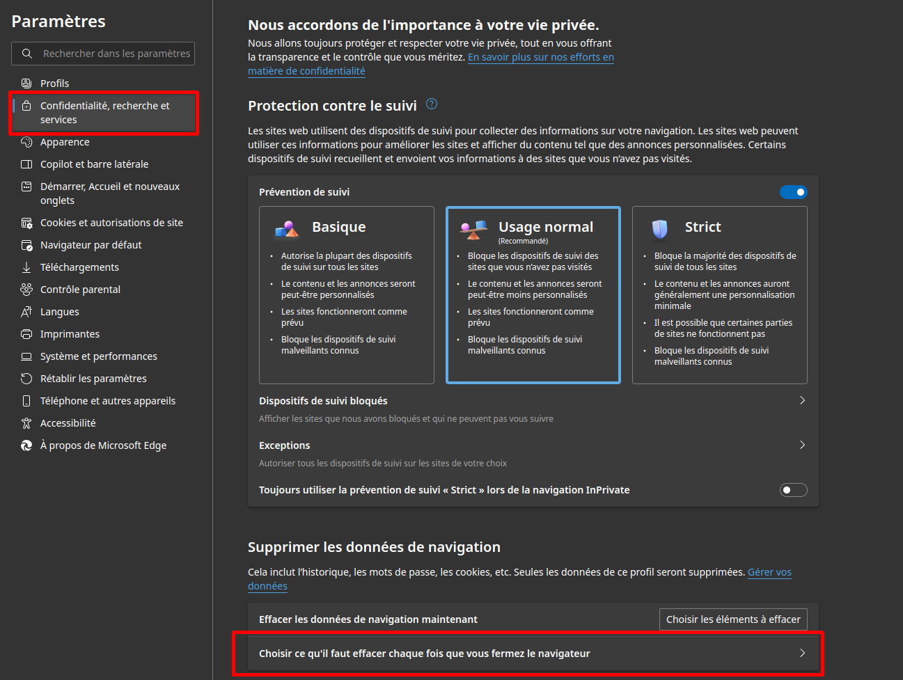
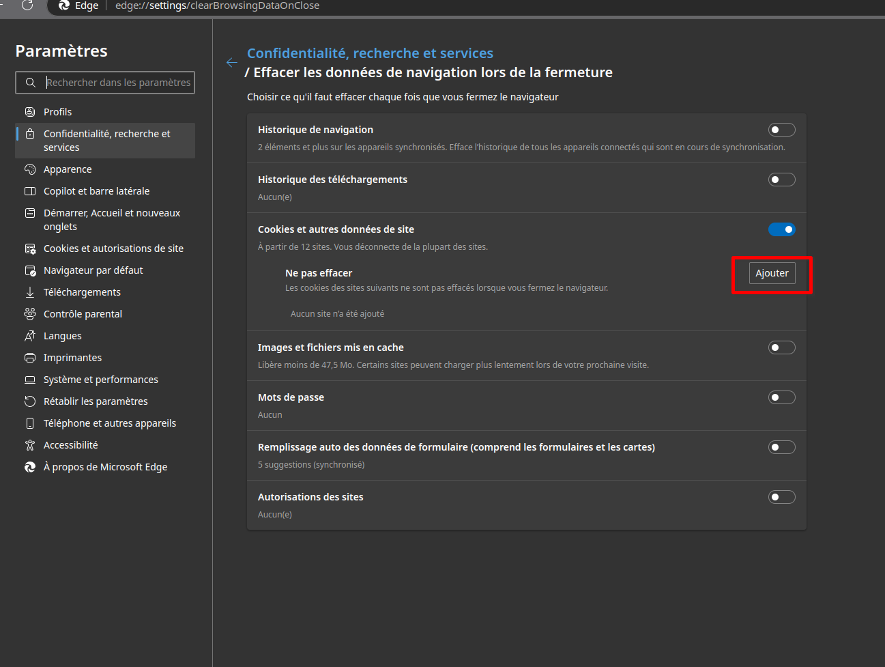
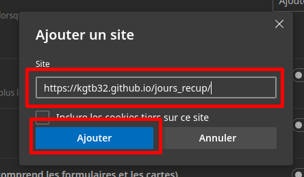

# Configuration sur Edge

Edge par défaut est configuré pour effacer l'intégralité de données à la fermeture. Pour éviter une perte de données, il faut ajouter une exception dans le navigateur :

1. Ouvrez les paramètres du navigateur
2. Accédez à la section `confidentialié, recherche et services`

3. Dans cette section, accédez au menu `Choisir ce qu'il faut effacer chaque fois que vous fermez le navigateur`.
4. Dans la catégorie `Cookies et autres données du site > ne pas effacer`, ajoutez une exception :

5. Entrez l'URL suivante et cliquez sur `Ajouter`

URL: https://kgtb32.github.io/jours_recup

